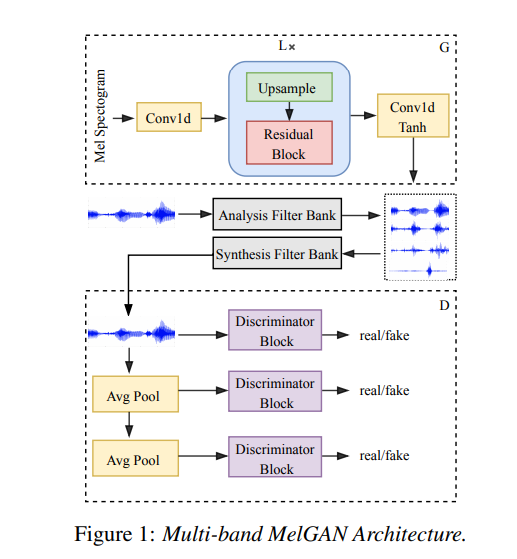

# Multi-band MelGAN and Full band MelGAN
Unofficial PyTorch implementation of [Multi-Band MelGAN paper](https://arxiv.org/abs/2005.05106). This implementation uses [Seungwon Park's](http://swpark.me) MelGAN repo as a base and PQMF filters
implementation from this [repo](https://github.com/kan-bayashi/ParallelWaveGAN). 
<br>**MelGAN :**

<br>
**Multi-band MelGAN:**<br>

## Prerequisites

Tested on Python 3.6
```bash
pip install -r requirements.txt
```

## Prepare Dataset

- Download dataset for training. This can be any wav files with sample rate 22050Hz. (e.g. LJSpeech was used in paper)
- preprocess: `python preprocess.py -c config/default.yaml -d [data's root path]`
- Edit configuration `yaml` file

## Train & Tensorboard

- `python trainer.py -c [config yaml file] -n [name of the run]`
  - `cp config/default.yaml config/config.yaml` and then edit `config.yaml`
  - Write down the root path of train/validation files to 2nd/3rd line.
  - Each path should contain pairs of `*.wav` with corresponding (preprocessed) `*.mel` file.
  - The data loader parses list of files within the path recursively.
  - For **Multi-Band** training use `config/mb_melgan` config file in `-c`
- `tensorboard --logdir logs/`

## Pretrained model
WIP

## Inference

- `python inference.py -p [checkpoint path] -i [input mel path]`

## Results
WIP

## References
- [Multi-band MelGAN](https://arxiv.org/abs/2005.05106)
- [MelGAN](https://arxiv.org/abs/1910.06711)
- [Pytorch implementation of melgan](https://github.com/seungwonpark/melgan)
- [Official implementation of melgan](https://github.com/descriptinc/melgan-neurips)
- [Multi, Full-band melgan implementation](https://github.com/kan-bayashi/ParallelWaveGAN)
- [Nvidia's pre-processing](https://github.com/NVIDIA/tacotron2)
- [WaveRNN](https://github.com/fatchord/WaveRNN)


## License

BSD 3-Clause License.

- [utils/stft.py](./utils/stft.py) by Prem Seetharaman (BSD 3-Clause License)
- [datasets/mel2samp.py](./datasets/mel2samp.py) from https://github.com/NVIDIA/waveglow (BSD 3-Clause License)
- [utils/hparams.py](./utils/hparams.py) from https://github.com/HarryVolek/PyTorch_Speaker_Verification (No License specified)

## Useful resources

- [How to Train a GAN? Tips and tricks to make GANs work](https://github.com/soumith/ganhacks) by Soumith Chintala
- [Official MelGAN implementation by original authors](https://github.com/descriptinc/melgan-neurips)
- [Reproduction of MelGAN - NeurIPS 2019 Reproducibility Challenge (Ablation Track)](https://openreview.net/pdf?id=9jTbNbBNw0) by Yifei Zhao, Yichao Yang, and Yang Gao
  - "replacing the average pooling layer with max pooling layer and replacing reflection padding with replication padding improves the performance significantly, while combining them produces worse results"
